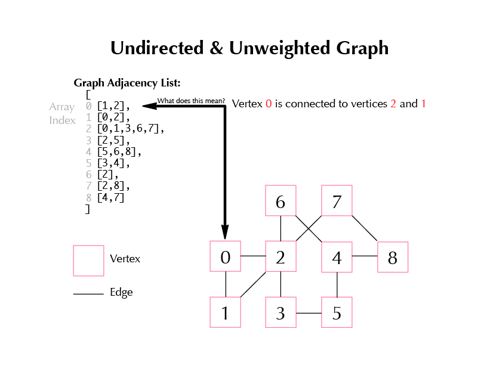
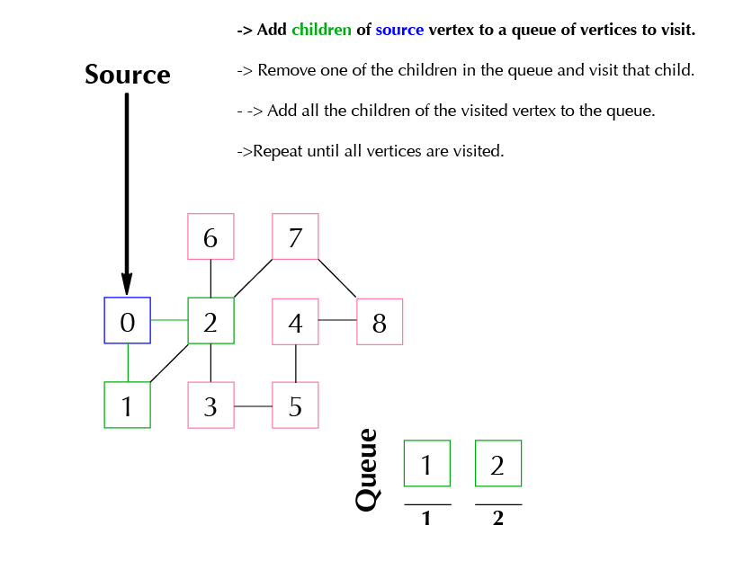
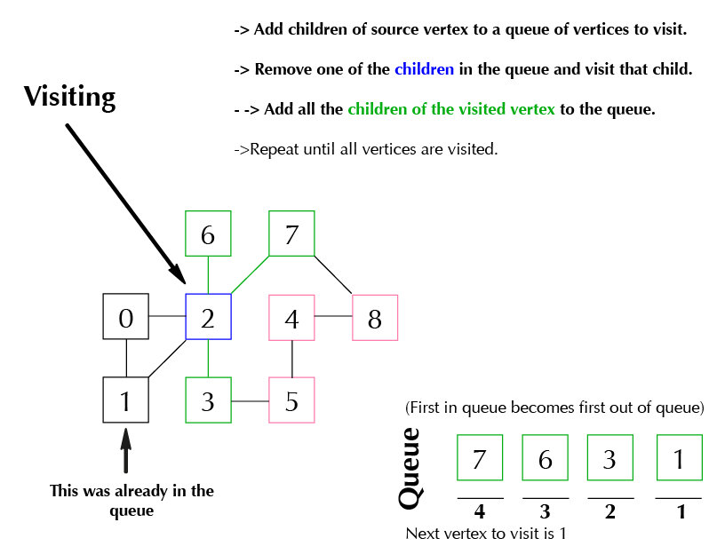

# Graph Data Structures
Graph data structures are one of the most important data structures that we use.  Graphs can be used to represent a variety of real-world scenarios which the computer can understand to help us solve certain problems.  

One of the most common and popular problems that can be solved by organizing data as a graph is finding the **shortest path** between two points.  That will be our ultimate goal for this exercise.

The data structure we will be using is an undirected and unweighted graph.  There are other types of graphs that include direction, and/or weight.  Those can be useful in representing roads with distance and cities as vertices.

## Setup
 * Fork and clone
 * In terminal: `npm install` , then `jasmine`


This is what the graph looks like in the form of an adjacency list that we are given:
```Javascript
var graphList = [
  [1,2],
  [0,2],
  [0,1,3,6,7],
  [2,5],
  [5,6,8],
  [3,4],
  [2],
  [2,8],
  [4,7]
]
```
## Further Explanation of what this array represents


## Breadth-First Search
Breadth-First Search (BFS) is an extremely important algorithm to have in our toolbelt.  Here we'll be using it to track the **distance** every **vertex** is from a given source.

BFS, at a high level, involves adding the children of a starting vertex to a queue, visiting them, and adding *their* children to the queue and so on until every vertex is visited.

 * Add children of source vertex to a queue of vertices to visit



* Remove one of the children in the queue and visit that child
 * Add all the children of the visited vertex to the queue



* Repeat until all vertices are visited

**BFS in practice:**

Here is what a partial output might look like for vertex 4, if the source node is 0. We would say that the distance from **vertex 0** to **vertex 4** is **4 degrees**.  That means that the shortest path from 0 to 4, is 4 edges.
```
{ vertex: 4,
    edges: [ 5, 8 ],
    distance: 4,
    predecessor: { vertex: 5, edges: [Object], distance: 3, predecessor: [Object] } }
```
